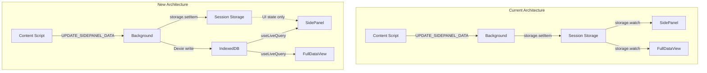
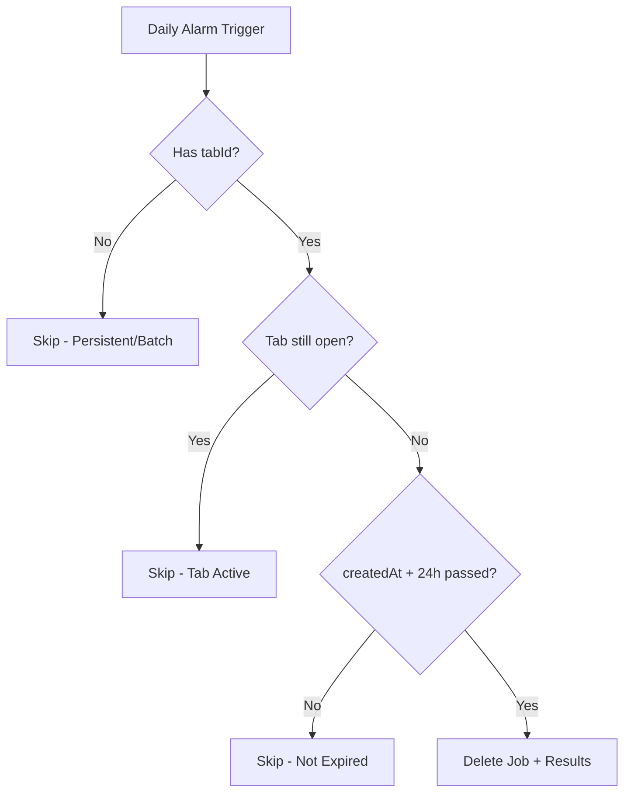

# Single URL Scrape Migration to Dexie (Revised v2)

## Architecture Overview



## Table Renaming

| Old Name | New Name | Reason |

|----------|----------|--------|

| `BatchScrapeJob` | `ScrapeJob` | Generic, handles both single and batch |

| `BatchScrapeUrlResult` | `ScrapeUrlResult` | Generic, handles both types |

| `BatchScrapeDB` | `ScrapeDB` | Consistent naming |

| `BatchSettings` | `ScrapeSettings` | Consistent naming |

| `BatchStatistics` | `ScrapeStatistics` | Consistent naming |

## Data Model Changes

Extend `ScrapeJob` (formerly `BatchScrapeJob`) in [`src/utils/batch-scrape-db.ts`](src/utils/batch-scrape-db.ts):

```typescript
interface ScrapeJob {
  id: string
  name: string
  tabId?: number // NEW: If set = single/ephemeral, if null = batch/persistent
  config: ScrapeConfig
  urls: string[] // Single scrapes: array of 1
  status: 'pending' | 'running' | 'paused' | 'completed' | 'cancelled'
  createdAt: number
  updatedAt: number
  settings: ScrapeSettings // Use defaults for single scrapes
  statistics: ScrapeStatistics
}
```

**Key simplifications:**

- No `type` field - derive from `tabId` presence (`tabId` set = single, null = batch)
- No `tabUrl` - URL is in the `urls` array
- No `expiresAt` - derive from `createdAt` + constant (24h)
- "Promoting" a scrape = clearing `tabId` to make it persistent

## Cleanup Logic

**Auto-cleanup eligibility:**

- `tabId` is set (associated with a tab)
- AND tab is closed
- AND `createdAt` + 24 hours has passed

**Promoting to persistent:**

- User action sets `tabId = undefined`
- Scrape no longer eligible for auto-cleanup

**Cleanup frequency:**

- Daily alarm using chrome.alarms API



## State Split

| State | Storage | Reason |

|-------|---------|--------|

| `scrapeResult` | IndexedDB | Main data, needs cross-context sync |

| `currentScrapeConfig` | Session Storage | Ephemeral, tab-specific UI state |

| `elementDetails` | Session Storage | Ephemeral, tab-specific |

| `pickerModeActive` | Session Storage | Ephemeral, tab-specific |

| `highlightMatchCount/Error` | Session Storage | Ephemeral, tab-specific |

## Implementation Steps

### 1. Rename and Schema Migration

- Rename all `Batch*` types/functions to generic `Scrape*` names
- Add Dexie version 3 with new field: `tabId`
- Add index on `tabId` for efficient single-scrape lookups

### 2. Minimal Function Changes

Modify existing functions in [`src/utils/batch-scrape-db.ts`](src/utils/batch-scrape-db.ts):

- `createScrapeJob(config, urls, name?, settings?, tabId?)` - add optional `tabId` param
- Add helper: `getScrapeJobForTab(tabId)` - one-liner query filter
- Add helper: `liveGetScrapeJobForTab(tabId)` - for useLiveQuery
- Add helper: `promoteScrapeJob(id)` - sets `tabId = undefined`

No need for separate single-scrape CRUD - reuse existing functions.

### 3. Background Handler Updates

Modify [`src/entrypoints/background/handlers/messages.ts`](src/entrypoints/background/handlers/messages.ts):

- When handling `UPDATE_SIDEPANEL_DATA` with `scrapeResult`:
  - Check if scrape job exists for tab → update it
  - Otherwise create new scrape job with `tabId`
- Keep other UI state updates going to session storage

### 4. Daily Cleanup Alarm

Add to background:

- Register alarm: `chrome.alarms.create('cleanup-expired-scrapes', { periodInMinutes: 1440 })`
- Alarm handler: query jobs with `tabId` set, check if tab closed + expired, delete

### 5. SidePanel Updates

Modify [`src/entrypoints/sidepanel/SidePanel.tsx`](src/entrypoints/sidepanel/SidePanel.tsx):

- Use `useLiveQuery` to get scrape result for current tab
- Keep `storage.watch` for UI state only
- Add "Save" button to promote scrape (make persistent)

### 6. FullDataView Updates

Modify [`src/entrypoints/full-data-view/FullDataViewApp.tsx`](src/entrypoints/full-data-view/FullDataViewApp.tsx):

- Query scrapes where `tabId` is set (single scrapes) from Dexie
- Use `useLiveQuery` for reactive updates
- Remove session storage watchers

### 7. UI Consolidation (Deferred)

Keep Full Data View and Batch Scrape History as separate views for now.

Future: Consider consolidating into unified "Scrape History" view.

## Files to Modify/Rename

| File | Changes |

|------|---------|

| `src/utils/batch-scrape-db.ts` | Rename to `scrape-db.ts`, rename types/functions, add schema v3 |

| `src/utils/batch-operations.ts` | Rename to `scrape-operations.ts`, update imports |

| `src/utils/types.ts` | Remove scrapeResult from SidePanelConfig |

| `src/entrypoints/background/handlers/messages.ts` | Route scrapeResult to Dexie |

| `src/entrypoints/background/handlers/batch-scrape.ts` | Update imports |

| `src/entrypoints/background/listeners/*.ts` | Add cleanup alarm listener |

| `src/entrypoints/sidepanel/SidePanel.tsx` | Use useLiveQuery, add promote button |

| `src/entrypoints/full-data-view/FullDataViewApp.tsx` | Query Dexie |

| `src/entrypoints/batch-scrape/*` | Update imports after rename |

| `src/entrypoints/batch-scrape-history/*` | Update imports after rename |

## Single Scrape Data Storage

Single scrapes store the same data as batch scrapes:

- `tabId`: The associated browser tab ID (presence = ephemeral)
- `config`: Full ScrapeConfig (mainSelector, columns)
- `urls`: Array with single URL (the tab's URL)
- `settings`: Default values (concurrency: 3, delay: 1000, retries: 3, disableJs: false)
- `statistics`: Computed same as batch (total: 1, completed: 1, etc.)
- `ScrapeUrlResult`: Full result data with url, status, result, timestamps
